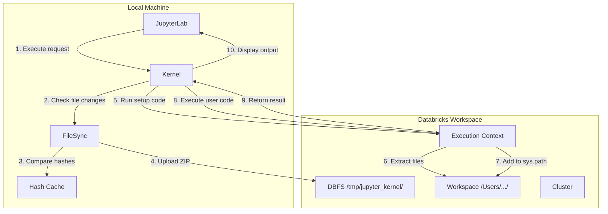

# Architecture

## Overview

jupyter-databricks-session-kernel is a Jupyter kernel that executes Python code entirely on Databricks clusters. Unlike Databricks Connect, which runs Python locally and only sends Spark operations to the cluster, this kernel sends all code to the remote cluster for execution.

### Design Principle: Complete Remote Execution

| Aspect | This Kernel | Databricks Connect |
|--------|-------------|-------------------|
| Python execution | Remote cluster | Local machine |
| PySpark execution | Remote cluster | Remote cluster |
| GPU access | Remote GPU | Local only |
| Package dependencies | Cluster packages | Local packages |

This design enables use cases where local resources are insufficient, such as GPU-accelerated workloads or large-memory operations.

## Components

The kernel consists of four main modules:

```text
src/jupyter_databricks_kernel/
├── kernel.py      # Jupyter kernel implementation
├── executor.py    # Databricks execution context management
├── sync.py        # File synchronization to DBFS
└── config.py      # Configuration loading and validation
```

### kernel.py

The main kernel class that implements the Jupyter kernel protocol. Handles:

- Kernel lifecycle (initialize, execute, shutdown)
- File synchronization coordination
- Result formatting and display

### executor.py

Manages the Databricks execution context using the Command Execution API. Handles:

- Context creation and destruction
- Code execution with timeout handling
- Automatic reconnection on context invalidation

### sync.py

Implements file synchronization from local machine to the Databricks cluster. Handles:

- File collection with exclude pattern support
- Hash-based change detection (MD5)
- ZIP creation and DBFS upload
- Remote extraction to Workspace

### config.py

Loads and validates configuration from environment variables and YAML files. Handles:

- Configuration precedence (environment variables > YAML file)
- Validation of required settings
- Default value management

## Data Flow



### Execution Flow Details

1. User executes a cell in JupyterLab
2. Kernel checks if local files have changed since last sync
3. FileSync compares current file hashes against cached hashes
4. Changed files are zipped and uploaded to DBFS
5. Setup code extracts the ZIP on the cluster
6. Files are extracted to the user's Workspace directory
7. The extraction directory is added to `sys.path`
8. User code is executed via Command Execution API
9. Results (stdout, stderr, display data) are collected
10. Formatted results are displayed in JupyterLab

## Session Lifecycle

### Initialize

When the kernel starts:

1. Load configuration from environment and YAML file
2. Validate required settings (cluster_id)
3. Create session ID (UUID)

### First Execution

On the first code execution:

1. Create execution context on the cluster
2. Perform initial file synchronization
3. Execute setup code to configure `sys.path`

### Subsequent Executions

For each code execution:

1. Check if files need synchronization
2. Sync if needed (hash-based detection)
3. Execute code via existing context
4. Handle reconnection if context is lost

### Shutdown

On kernel shutdown:

1. Clean up DBFS files (`/tmp/jupyter_kernel/{session_id}/`)
2. Clean up Workspace files (`/Workspace/Users/{user}/jupyter_kernel/{session_id}/`)
3. Destroy execution context

## File Synchronization Architecture

### Sync Strategy

Files are synchronized using a ZIP-based approach:

1. Collect all files (respecting exclude patterns)
2. Compute MD5 hashes for change detection
3. Create ZIP archive of changed files
4. Upload to DBFS
5. Extract on cluster via `dbutils.fs.cp` and `zipfile`

### Storage Locations

| Location | Purpose |
|----------|---------|
| DBFS `/tmp/jupyter_kernel/{session_id}/` | Temporary ZIP storage |
| Workspace `/Workspace/Users/{user}/jupyter_kernel/{session_id}/` | Extracted files for execution |

### Exclude Patterns

Files are excluded based on:

1. `.databricks` directory (always excluded)
2. `.gitignore` patterns (if present)
3. User-configured exclude patterns in `.databricks-kernel.yaml`

## Reconnection Mechanism

The kernel automatically handles context invalidation:

1. Detect context errors via regex pattern matching
2. Wait briefly (1 second) for cluster stabilization
3. Create new execution context
4. Re-run file synchronization setup
5. Retry the failed command

Context errors are detected by patterns like:

- "context not found"
- "context does not exist"
- "context is invalid"
- "execution context expired"
